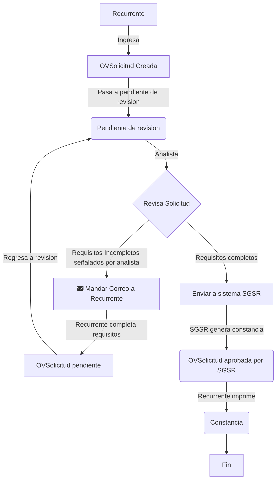

```mermaid
graph TD
    I[Recurrente] -->|Ingresa| A[OVSolicitud Creada]
    A -->|Pasa a pendiente de revision| B(Pendiente de revision)
    B -->|Analista| C{Revisa Solicitud}
    C -->|Requisitos Incompletos señalados por analista| D[fa:fa-envelope Mandar Correo a Recurrente]
    C -->|Requisitos completos| E[Enviar a sistema SGSR]
    D -->|Recurrente completa requisitos| R[OVSolicitud pendiente]
    R -->|Regresa a revision| B
    E -->|SGSR genera constancia| F(OVSolicitud aprobada por SGSR)
    F -->|Recurrente imprime| G(Constancia)
    G --> H[Fin]
```
